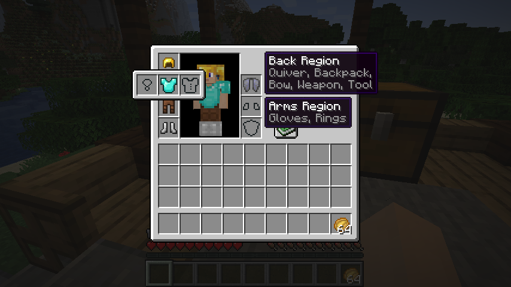

# Wearables Mod / API

Wearables is an API for [Fabric] which allows adding and accessing additional, configurable equipment slots on any entity, presenting them through easy-to-access equipment regions which are based on existing Vanilla equipment slots (called "regions"), as well as custom-defined regions.

**Currently very much a work in progress!**  
Only meant to be used by mod developers and similarly crazy people.




## Download

Available right here through [GitHub Releases][Releases].  
You know what to do, yet keep in mind the current status of the mod.

*In the event that this API becomes self-aware, we are not responsible for any damage it causes.*


### Set up as Dependency

```gradle
// Add the following to your repositories:
maven { url "http://server.bbkr.space:8081/artifactory/libs-release/" }
// Add this to your your dependencies:
modCompile "net.mcft.copy:Wearables:${wearables_version}"
// (Use modApi if you're using Loom 0.2.4 or later.)
```


## Comparison to Existing Mods

- ***Baubles***
  defines 8 additional, hardcoded slots: Amulet, head, 2x ring, body, charm, belt. I've noticed that some of these slots get little attention from most mods, most allow equipping their utility items simply into any *Baubles* slot. And often it sometimes wasn't enough, as can be seen by the existence of competitors with their own slots, GUIs and key bindings.

- ***[Curios]***
  is another API which was recommended to me for inspiration. It appears to solve the problem of hardcoded slots by allowing data packs (which can be part of mods) to define items to fit in any custom slot. Unfortunately this comes at a cost: Additional slots are just dumped unordered into a simple list, making things look ugly.

*Wearables* aims to combine the two approaches: Providing a pretty, user-friendly way of accessing custom slots, while being highly expandable and configurable. Both by modders to integrate their mods, and mod pack creators to spice up their packs. On top of that, all that without the use of additional GUIs or keybinds!


## Data Pack Configuration

### Items

Any existing item in the game can be configured to be equippable in custom equipment slots. This behavior can be defined in `config/wearables/item/`.

Special item handlers exist to deal with existing groups of items, such as `"!ItemArmor:chestplate"`. This allows setting adjusting the equipment behavior for Vanilla armor, so you may allow armor to be equipped in a set of cosmetic slots.

It is also possible to override Vanilla equipment rules, such as preventing an elytra from being equipped in the chestplate slot.

### Entities

Additional slots can be added to any entity type such as `minecraft:player` or `minecraft:zombie`. The data for this is loaded from the data pack folder `config/wearables/entity/`.

Some slot types that could be defined are `chest/chestplate`, `neck/amulet`, `waist/belt` and `hands/gloves`. Generally, the suggested format for additional is `bodypart/type`, in some rare cases it might also be `bodypart/type/subtype`. Multiple slots of a single type may exist per entity, for example in the case of rings.

There are plenty of possible uses for custom equipment slots:

- **Clothing:** Hat, Shirt, Pants, Socks
- **Additional Armor:** Shoulders, Elbows, Knees
- **Various / Cosmetic:** Amulet, Medal, Scarf
- **Back:** Backpack, Wings
- **Waist:** Belt, Pouch

Also defined per entity type, **equipment "regions"** only need to be used when slots need to be accessed through a GUI. They group together many slots by a filter mask, for example a `head` region may group all slot types that start with `head`, `mouth`, `nose`, `eyes`, `ears` and therefore include slots such as `head/hat` and `eyes/goggles`.

## Containers

**TODO:** You can modify the placement of equipment regions in containers.


## API

**TODO:** Add some API examples and tips.  
For now, just refer to the documentation.


[Fabric]:   https://fabricmc.net/
[Releases]: https://github.com/copygirl/Wearables/releases
[Curios]:   https://github.com/TheIllusiveC4/Curios
