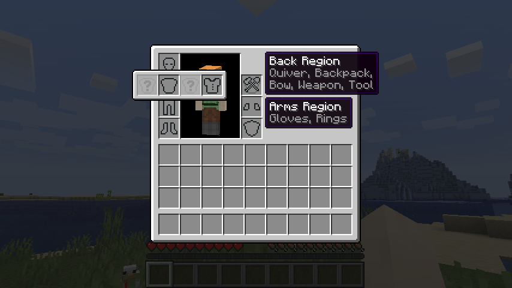

# Wearables Mod / API

Wearables is going to be an API for [Fabric] which allows adding and accessing additional equipment slots on entities.  
**(Work in progress!)**

The initial motivation for this comes from my backpacks (*BetterStorage* and later *Wearable Backpacks*), which should ideally just be able to make use of a "back" slot. To expand on that, it would be great to be able to carry certain other containers à la *TerraFirmaCraft*.

## Comparing to Existing Mods

- ***Baubles***
  defines a specific hardcoded set of extra slots: Amulet, head, 2x ring, body, charm, belt. Though I've noticed that some slots get little attention from the other mods. But still, these slots are sometimes not enough, as can be seen by the existence of competitors with their own slots, GUIs and key bindings.

- ***[Curios]***
  is another API that was recommended to me, to look at. It appears to solve the problem of hardcoded slots by allowing data packs (which can be part of mods) to define items to fit in any custom slot. Unfortunately this comes at a great cost: Additional slots are just dumped unordered into a simple list.

## Assimilate! Combine! Enhance!

Why not combine these two concepts - hardcoding sensible **equipment "regions"** with arbitrarily extensible **slots** - along with a slick (default) user interface?

## Equipment Region

This is the place on the body of the wearer which an equipment slot is generally associated with. There's four regions based on Vanilla slots as well as two new ones:

- **Head:** Clothing, Armor, Face
- **Chest:** *Cosmetic*, Armor, Clothing
- **Legs:** Armor, Waist, Clothing
- **Feet:** Armor, Clothing
- **Back:** Quiver, Item (Bow/Weapon/Tool/Shield), Backpack
- **Arms:** Gloves, Rings

In this list, left-most is also top-most "layer" while right-most is the bottom-most layer, when it comes to rendering. It might also be possible for some cosmetic items (such as an amulet) to be worn either below or above armor.

### Equipment Slots

An equipment region has slots that have been associated with it. More specific examples:

- **Clothing:** Hat (above armor), Shirt, Pants, Socks
- **Armor:** Vanilla armor, Shoulders, Elbows, Knees
- **Cosmetic:** Amulet, Medal, Scarf
- **Waist:** Belt, Pouch

As a concrete example, some slots that may be defined are `"chest:armor/chestplate"`, `"chest:neck/amulet"`, `"legs:waist/belt"` and `"arms:hands/gloves"`. Generally, the suggested format for additional is `region:bodypart/type`, in some cases it might also be `region:category/type`, such as for `"chest:armor/chestplate"` or `"chest:clothing/shirt"`.

### Slot Hierarchy

While the recommended number of parts (the text separated by `'/'`) for what items fit into which slots is 2, it could theoretically be more or less.

When there's two items types that fit into the slots `"chest:neck/amulet"` and `"chest:neck/scarf"`, but *Wearables* is configured to only have a single `"chest:neck"` slot, either item could fit into this slot. If however there's both a `"chest:neck"` slot and a `"chest:neck/amulet"` slot set up, amulets would only go into their specific slot while scarfs would only go into the more general one.

## Interaction / User Experience

Starting out, perhaps with the exception of the addition of two new slots in the player's survival inventory, there won't be anything immediately noticable.

When the player first picks up or hovers over a "wearable" item that fits into a custom slot, they'll either see the "region popup" appear right away (see screenshot), perhaps with the fitting slot highlighted; or the particular equipment region highlights, followed by the slot when hovering over the region. By default, only compatible or already occupied custom slots would be visible, as to not overwhelm the player.

Once an item is equipped in a non-default slot, it may be indicated by a small plus icon or similar. Howering over the slot will once again bring up the popup and allows taking out the item.

I believe this would reduce the chances of being annoying, especially by avoiding adding more keybinds, buttons or too many slots to the survival inventory, while still being incredibly usable.

## API / Configuration

Usability is not everything. Mod compatibility and extensibility is important as well! As such, any custom slot can be used by items! All that is needed would be to add the items to an item tag just like described in [Curios], such as `"chest:neck/amulet"` for an amulet or `"head:clothing/hat"` for a hat. This could be done through a data pack, so no custom mod is even required. (Unsure about how this data is stored. Perhaps custom data is used rather than item tags.)

On the API side of things, slots may be registered to have custom behavior, be disabled by default, or for there to be multiple of them available for items to be placed into (such as rings).

In the future I'd also like to see the possibility of creating a dedicated, modpack-specific equipment interface defined by a `.json` file or similar where all slots have a defined position and are always visible, for modpack creators seeking to refine their creation and give it a bit more of a unique feel.

[Fabric]: https://fabricmc.net/
[Curios]: https://github.com/TheIllusiveC4/Curios
